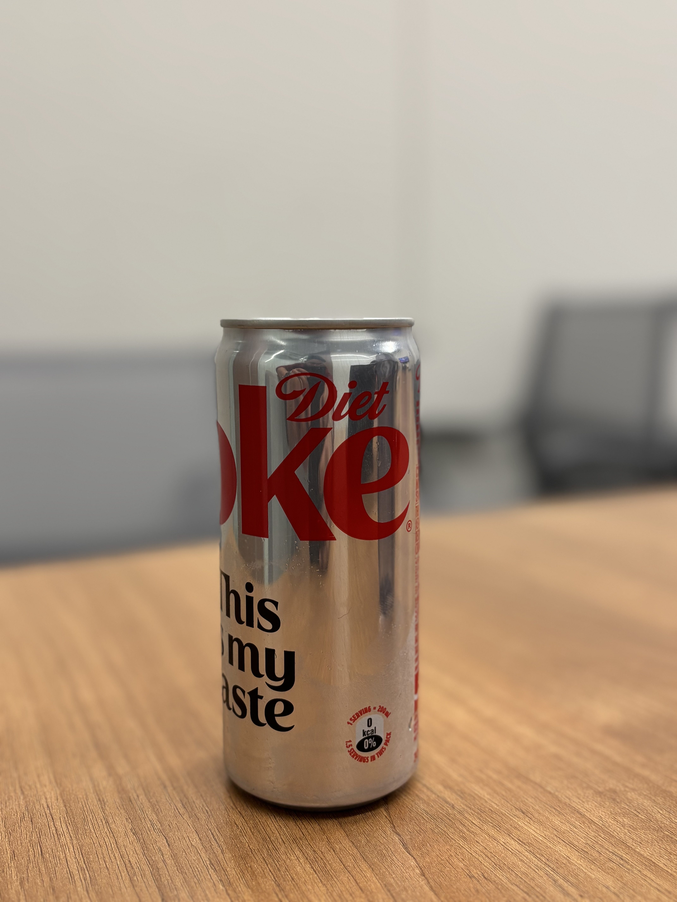

# Prompt-Based Object Detection and Inpainting

This project leverages state-of-the-art object detection and segmentation models, namely GroundingDINO and Segment Anything (SAM), integrated with the Fooocus image generation API wrapped in FastAPI to perform image inpainting tasks locally. It allows users to identify specific objects in an image based on textual prompts, segment them accurately, and replace or modify the background using generative AI.

## Problem and Approach

**Problem:**
- Traditional methods of object segmentation and inpainting often lack precision or require extensive manual intervention. There's a need for an automated, precise, and easy-to-use pipeline that allows intuitive interaction via text prompts.

**Approach:**
- Utilize **GroundingDINO** for prompt-based object detection.
- Use **Segment Anything (SAM)** to precisely segment detected objects.
- Integrate the **Fooocus inpainting API**(https://github.com/lllyasviel/Fooocus.git) (via FastAPI on local port 1505) to seamlessly regenerate backgrounds based on text prompts.

---
## Example Results
<table>
  <thead>
    <tr>
      <th>Input Image</th>
      <th>Detection Prompt</th>
      <th>Background Prompt</th>
      <th>Processed Image</th>
    </tr>
  </thead>
  <tbody>
    <tr>
      <td></td>
      <td>Coke Can</td>
      <td>A diet coke in 80s Diner environment</td>
      <td></td>
    </tr>
  </tbody>
</table>


## Getting Started

### Prerequisites
- Python 3.8+
- CUDA-compatible GPU (optional but recommended)

### Installation

1. Clone this repository:
```bash
git clone https://github.com/Vasu-yadav/prompt_based_inpainting.git
cd prompt_based_inpainting
```

2. Install required libraries:
```bash
pip install -r requirements.txt
```

3. Ensure model weights are downloaded and stored in the `models/` directory:
- GroundingDINO weights: `models/grounding_dino/groundingdino_swint_ogc.pth`(wget -q https://github.com/IDEA-Research/GroundingDINO/releases/download/v0.1.0-alpha/groundingdino_swint_ogc.pth)
- Segment Anything (SAM) weights: `models/sam_vit_h_4b8939.pth`(https://dl.fbaipublicfiles.com/segment_anything/sam_vit_h_4b8939.pth)

4. Run the Fooocus inpainting API locally:
- Follow Below steps to setup Fooocus API
    1. ```bash 
        cd Fooocus
        ```
    2. ```bash
        Docker build -t fooocusapi -f API_Dockerfile.dockerfile .
        ```
    3. ```bash
        docker run -d \
        --name fooocus_api \
        -p 0.0.0.0:1505:1505 \
        --gpus '"device=0"' \
        -v ./models:/app/models \
        fooocusapi
        ```
### Running the Gradio App (Demo Interface)

Ensure your Fooocus API is running locally on port `1505`, then launch your Gradio interface:
```bash
python gradio_app.py
```

The app will launch and be accessible at:
```
http://localhost:1508/image-inpainting-gradio/
```

### Usage

- Basic usage to detect and segment objects from an image and replace background:

```python
from prompt_inpaint import ImageProcessor
import cv2

image_processor = ImageProcessor()

image = cv2.imread('your_image.jpg')
image_rgb = cv2.cvtColor(image, cv2.COLOR_BGR2RGB)

prompt = "person"
bg_prompt = "beach during sunset"

result_image, mask = image_processor.process_image(image_rgb, prompt, bg_prompt)

cv2.imwrite("result.png", cv2.cvtColor(result_image, cv2.COLOR_RGB2BGR))
```


---

## Future Prospects
- **Enhanced Prompt Integration:** Allow more detailed instructions or complex scenarios.
- **Real-time Performance Optimization:** Improve inference speed for practical deployment.
- **User-friendly Web UI:** Develop a simple web interface for broader accessibility.
- **Expand Use Cases:** Extend this pipeline to video processing for dynamic background replacement or object manipulation.

---

## Contributions
Contributions and feature requests are welcome. Please open an issue or submit a pull request to improve the project.

